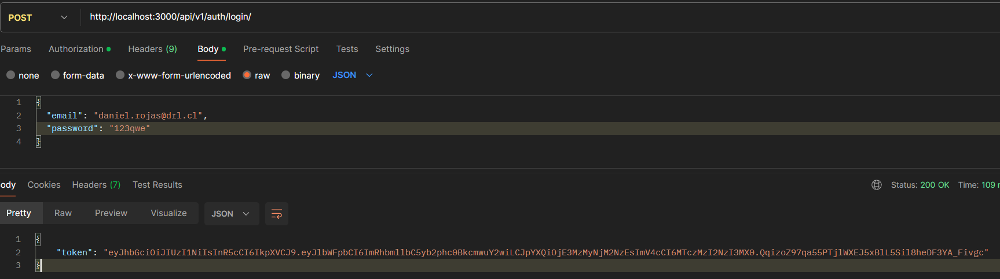
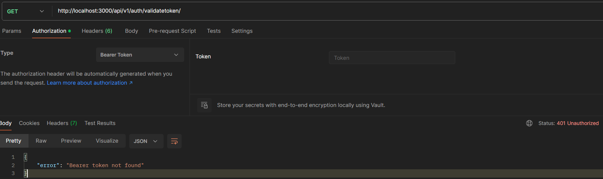
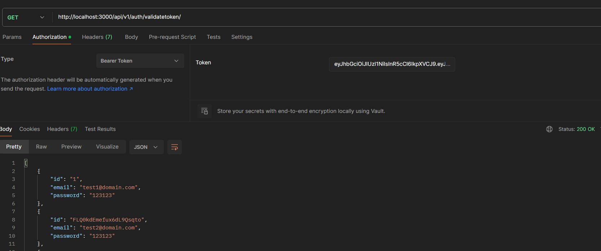

# Daniel Rojas
## hito_1_aplicacion_backend


Librerias necesarias


```bash
Desarrollo:
npm i --save-dev @types/bcryptjs @types/express @types/jsonwebtoken @types/node pkgroll tsx typescript

npm i --save-dev dotenv tsc nodemon nanoid

Globales:

npm install bcryptjs express jsonwebtoken nanoid --save

```
Para ejecutar la tarea se debe iniciar la terminal y ejecutar el siguiente comando

```bash
npm install

npm run dev

```


Endpoint CRUD de User
```bash
Get    http://localhost:3000/api/v1/user/
Get    http://localhost:3000/api/v1/user/{id}     
Put    http://localhost:3000/api/v1/user/{id}
{
  "email": "daniel.rojas@drl.cl",
  "password": "123qwe",
  "fullName": "Daniel Rojas",
  "profile": "Administrator"
}
Post   http://localhost:3000/api/v1/user/
{
  "email": "daniel.rojas@drl.cl",
  "password": "123qwe",
  "fullName": "Daniel Rojas",
  "profile": "Administrator"
}
Delete http://localhost:3000/api/v1/user/{id}
```
Endpoint de Autentificación con JWT

```bash


Post   http://localhost:3000/api/v1/auth/login/
{
  "email": "daniel.rojas@drl.cl",
  "password": "123qwe"
}
```
Con el bearer Token generado en se puede ejecutar las siguiente endpoint que tiene bloqueo por jwt
```bash
Get    http://localhost:3000/api/v1/auth/validatetoken/
Bearer Token 

Post   http://localhost:3000/api/v1/auth/register/
Bearer Token

```


Ejemplo de ejecucion








